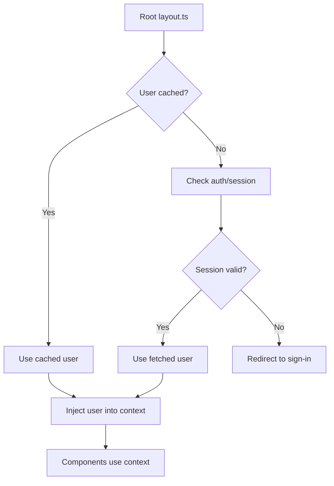

In this section, we explain how to contribute to the Snowballr frontend project. We cover the following topics:

- [Project Layout](#project-layout)
- [User Context](#user-context)
  - [How the User is Fetched and Made Available](#how-the-user-is-fetched-and-made-available)
  - [How to Use the User Context in Components](#how-to-use-the-user-context-in-components)
  - [Refreshing User Data](#refreshing-user-data)
- [Testing](#testing)
- [Lighthouse](#lighthouse)

To set up the development environment, follow the steps in
[Getting Started](https://github.com/SE-UUlm/snowballr-frontend/wiki/Getting-Started).

## Project Layout

```plaintext
.
├── api/                    (snowballr-api submodule)
├── scripts/                (helper scripts used in CI/CD or development)
├── src/
│   ├── lib/
│   │   ├── components/
│   │   │   ├── composites/ (our components)
│   │   │   └── primitives/ (shadcn/ui components)
│   │   └── model/
│   │       └── api/        (auto-generated API code)
│   └── routes/             (website layout)
├── tests/
│   ├── e2e/
│   ├── integration/
│   └── unit/
└── wiki/                   (this wiki)
```

## Creating a New Component

When creating a new component, please follow these guidelines:

1. **Location**: Place your component in the appropriate directory under `src/lib/components/`. Use `composites/` for
   custom components and `primitives/` for shadcn/ui components (refer to
   [the installation guide](https://shadcn-svelte.com/docs/installation/sveltekit)).
2. **Naming**: Use PascalCase for component files (e.g., `MyComponent.svelte`) and kebab-case for normal TS files (e.g.,
   `my-helper.ts`)
3. **Props**: Clearly define the props your component accepts. Use TypeScript for type safety.
4. **Documentation**: Add comments to your component to explain its purpose, usage and the meaning of its props.
5. **Testing**: Write integration tests for your component in the `tests/integration/` directory to ensure its
   functionality (see [the testing section](#testing)).

Example structure for `MyNewComponent`:

```svelte
<script lang="ts">
  // Imports

  // Component Props interface
  interface Props {
    foo: string;
    bar: number;
    children?: Snippet | undefined; // <- children are sub-components that can be rendered inside a component
  }

  let { foo, bar, children = undefined }: Props = $props();

  // More functions, variables, logic, ...
</script>

<!--
@component
This is my new component.

Usage:
\`\`\`svelte
    <MyNewComponent foo="Example" bar={0}>
        <span>This is a span!</span>
    </MyNewComponent>
\`\`\`
-->
<div>
  <h1>{foo}</h1>
  <span>{bar}</span>
  <div>{@render children?.()}</div>
</div>
```

The [NavigationBar component](https://github.com/SE-UUlm/snowballr-frontend/blob/develop/src/lib/components/composites/navigation-bar/NavigationBar.svelte)
is a good example of a well-structured component.

### How to Pass HTML Attributes to a custom component

Sometimes we want to set HTML attributes inside the component from outside when using it. For this we can change the
`Props` interface. From:

```svelte
<script lang="ts">
  interface Props {
    foo: string;
    bar: number;
    children?: Snippet | undefined;
  }
</script>
```

To:

```svelte
<script lang="ts">
  type Props = WithElementRef<HTMLButtonAttributes> & {
    foo: string;
    bar: number;
    children?: Snippet | undefined;
  };
  // or if the required Attributes type doesn't exist
  type Props = WithElementRef<HTMLAttributes<HTMLDivElement>> & {
    /** ... */
  };

  // Now we can use the HTML attributes as normal props
  let { foo, string, children = undefined, class: className, ...restProps }: Props = $props();
</script>

<!-- Now we use the props on native HTML elements -->
<div class={cn("w-40", className)} {...restProps}>
  <h1>{foo}</h1>
  <span>{bar}</span>
  <div>{@render children?.()}</div>
</div>
```

For an example of this, see the
[ToggleableInput component](https://github.com/SE-UUlm/snowballr-frontend/blob/develop/src/lib/components/composites/input/ToggleableInput.svelte).

### Skeletons

When loading data asynchronously, it's a good practice to show skeletons to indicate that content is being loaded. This
improves user experience by providing visual feedback during loading times. We use the
[shadcn/ui Skeleton component](https://shadcn-svelte.com/docs/components/skeleton) for this purpose. Often, we pass
promises to components and use the `await` block to handle loading states.

Here's an example of how to implement skeletons in a component:

```svelte
<script lang="ts">
  import { Skeleton } from "$lib/components/primitives/skeleton";

  interface Props {
    loadingData: Promise<ExampleData>;
  }

  const { loadingData }: Props = $props();
</script>

{#await loadingData}
  <!-- Render skeletons while data is loading -->
  <div class="space-y-2">
    <Skeleton class="h-6 w-3/4" />
    <Skeleton class="h-4 w-full" />
    <Skeleton class="h-4 w-5/6" />
  </div>
{:then data}
  <!-- Render actual content when data is loaded -->
  <div>
    <h1>{data.title}</h1>
    <p>{data.description}</p>
  </div>
{:catch error}
  <!-- Handle error state -->
  <div class="text-red-500">Error loading data: {error.message}</div>
{/await}
```

For a real-world example, see the
[ProjectInformation component](https://github.com/SE-UUlm/snowballr-frontend/blob/develop/src/lib/components/composites/statistics/ProjectInformation.svelte).

### Loading state on actions

While skeletons are great for initial data loading, it's also important to provide feedback during user-initiated
actions that may take time to complete, such as form submissions or data updates. Since these are often triggered by
buttons, we built a
[LoadingButton component](https://github.com/SE-UUlm/snowballr-frontend/blob/develop/src/lib/components/composites/button/LoadingButton.svelte)
that extends the standard button functionality to include a loading state. Itself has a rich documentation on how to use
it. For an example of its usage, see the
[ChangeNameSettings component](https://github.com/SE-UUlm/snowballr-frontend/blob/develop/src/lib/components/composites/settings/user-settings/ChangeNameSettings.svelte).

The key concepts to consider when implementing loading states on actions are:

- Disable the button while loading the page
- Show a spinner or loading indicator on the button when the action is in progress
- Disable the button while loading to prevent multiple submissions
- Change the button text to indicate the loading state (e.g., "Saving..." instead of "Save")
- Set a fix width to prevent layout shifts when the button text changes
- Provide feedback upon completion (e.g., success or error messages) through toasts or alerts

## User Context

The application provides a global user context that makes the currently authenticated user's data available throughout
the component tree.

### How the User is Fetched and Made Available



The initial user loading logic lives in the root
[layout.ts](https://github.com/SE-UUlm/snowballr-frontend/blob/develop/src/routes/%2Blayout.ts)
file. It checks whether a user is already cached using the `userCache`. If no cached user is found, it attempts to
determine the current authentication status and fetch the user accordingly. If the user is unauthenticated or the
session is invalid, it tries to renew the session or redirects to the sign-in page if necessary.

The resulting user object—whether fetched, cached, or an explicit "empty" user—is returned from `layout.ts` and injected
into the user context by the root
[layout.svelte](https://github.com/SE-UUlm/snowballr-frontend/blob/develop/src/routes/%2Blayout.svelte) file. This
ensures the user state is consistent and accessible throughout the app.

Components can safely assume that the user object is always valid and never `null` or `undefined`. In cases where the
user is not authenticated, the app will redirect to the sign-in page before components are rendered. This eliminates
the need for `null` checks in downstream components that rely on user data.

### How to Use the User Context in Components

To access the current user's data within any Svelte component that is a child of the main layout:

1. Import necessary utilities:
   You'll need `getContext` from Svelte, the `UserContextKey`, and potentially the `User` type.
2. Retrieve and use the user data:
   Use `getContext` with `UserContextKey` to get the getter function, and then call it. Wrap this in `$derived` to
   create a reactive variable that automatically updates when the user context changes.

   ```svelte
   <script lang="ts">
     import { getContext } from "svelte";
     import { UserContextKey, type UserContext } from "$lib/current-user/userContext";

     const user = $derived(getContext<UserContext>(UserContextKey)());

     function greet() {
       console.log(`Hello, ${user.firstName}!`);
     }
   </script>

   <p>Welcome, {user.firstName} {user.lastName}!</p>
   ```

### Refreshing User Data

If an action within a component modifies user data on the backend (e.g. updating profile information), you'll need to
trigger a refresh of the user context to ensure all parts of the application have the latest data.

1. Import the refresh function:

   ```svelte
   import {triggerCurrentUserRefresh} from "$lib/current-user/userCache";
   ```

2. Call the function after an update:

   ```svelte
   <script lang="ts">
     import { backendService } from "$lib/grpc-api";
     import { triggerCurrentUserRefresh } from "$lib/current-user/userCache";
     import { toast } from "svelte-sonner";
     import { StatusCodes } from "$lib/model/error-codes";
     import { getContext } from "svelte";
     import { UserContextKey, type UserContext } from "$lib/current-user/userContext";

     const user = $derived(getContext<UserContext>(UserContextKey)());

     async function handleNameUpdate(newName: string) {
       try {
         const response = await backendService.updateUser({
           user: { id: user.id, firstName: newName /* other fields */ },
           mask: { paths: ["first_name"] }, // Example field mask
         }).response;

         // Assuming your backendService call doesn't throw on non-OK gRPC status
         // and returns a structure with a status code. Adjust as per your actual API.
         // Or, if it throws, catch the error.

         triggerCurrentUserRefresh();
         toast.success("User details updated successfully!");
       } catch (error) {
         console.error("Failed to update user:", error);
         toast.error("Failed to update user details.");
       }
     }
   </script>
   ```

## Testing

For information about our testing setup, see [Testing](https://github.com/SE-UUlm/snowballr-frontend/wiki/Testing).

## Lighthouse

> [!WARNING] Our Lighthouse setup is currently not working due to recent changes. We are working on fixing it.

We use Lighthouse to audit the performance, accessibility and best practices of our app.
To run a Lighthouse audit on the app, you can use the following command:

```bash
npm run lighthouse
```

To run all available routes, use:

```bash
npm run lighthouse:all
```

The report will be saved in the `./lighthouse-reports` directory. To automatically open the report in your browser,
you can use the `--view` flag:

```bash
npm run lighthouse -- --view
# or
npm run lighthouse:all -- --view
```

To only run a sub-route, you can use the `--dir` flag:

```bash
npm run lighthouse -- --dir=/settings
# or
npm run lighthouse:all -- --dir=/settings
```

## Release Procedure

We create a new release whenever a set of features, bug fixes, or changes is ready to be deployed and used by the
users. To release a new version of the frontend, follow the steps in the
[SnowballR Wiki](https://github.com/SE-UUlm/snowballr/wiki/Contributing#release-procedure).
