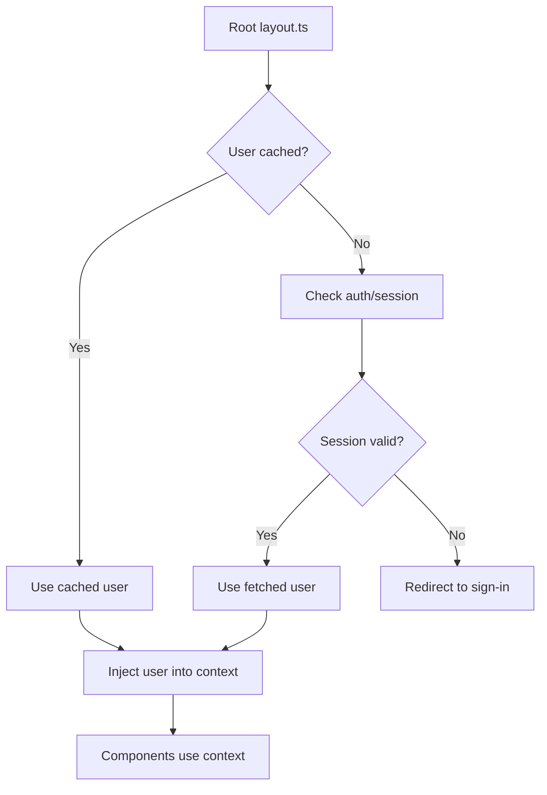

In this section, we explain how to contribute to the Snowballr frontend project. We cover the following topics:

- [Contribution Workflow \& Conventions](#contribution-workflow--conventions)
  - [Workflow](#workflow)
  - [Commits \& Branches](#commits--branches)
- [Project Layout](#project-layout)
- [User Context](#user-context)
  - [How the User is Fetched and Made Available](#how-the-user-is-fetched-and-made-available)
  - [How to Use the User Context in Components](#how-to-use-the-user-context-in-components)
  - [Refreshing User Data](#refreshing-user-data)
- [Testing](#testing)
- [Lighthouse](#lighthouse)
- [Teamscale Integration](#teamscale-integration)

To set up the development environment, follow the steps in
[Getting Started](https://github.com/SE-UUlm/snowballr-frontend/wiki/Getting-Started).

## Contribution Workflow & Conventions

### Workflow

Starting from an issue, we create a branch with the name of the issue (see [Commits & Branches](#commits--branches)).
It's up to you, whether you create a draft pull request immediately or wait until you are finished with the
implementation. While creating a draft pull request gives you direct feedback from the CI/CD pipeline, it also clutters
the pull request list. So it's up to you whether you want to create a draft pull request or not.

When starting to work on an issue, ensure that the issue is assigned to you and part of our project `SnowballR`.
Furthermore, make sure you set the status to `In progress` and the iteration to the current one (if that is not already
done). **Prefer** to work on issues that are already assigned to you and part of the current iteration/sprint.

When you are finished with the implementation, create a pull request (when not already done) and fill out the template.
If other branches were merged into `develop` while you were working on the issue, make sure to rebase your branch onto
the `develop` branch (`git rebase origin/develop`) and resolve any conflicts. Make sure that you don't rebase your
branch after you requested a review, as we experienced that the comments are hard to find afterward. Continue with
setting the status of the issue to `To review`. One other team member will then assign themselves as reviewer and set
the status to `In review`.

The reviewing process works as follows:

1. The reviewer will check the code and provide feedback. This can be done by adding comments to the pull request,
   preferably annotating the code directly. The reviewer can also approve the pull request if everything is fine.
2. If the reviewer requests changes, the author of the pull request (you) will either implement the changes or
   provide a reason why the changes are not necessary. In either case, the author should respond to all comments. The
   author should never resolve any comments themselves as this is the responsibility of the reviewer.
3. Once the reviewer is satisfied with the changes, they will approve the pull request. You can then merge the pull
   request into the `develop` branch. Make sure to use merge commits and not squash or rebase.
4. If there were updates to the `develop` branch while the pull request was in review, you will need to rebase your
   branch onto the `develop` branch again and resolve any conflicts. Make sure this is discussed with the reviewer.
5. After merging the pull request, the issue is automatically closed and the status is set to `Done`.

### Commits & Branches

For commits, we follow the [Conventional Commits](https://www.conventionalcommits.org/en/v1.0.0/) specification. The
commits are automatically checked by the [`Semantic PRs`](https://github.com/Ezard/semantic-prs) GitHub App when
creating a pull request.

A branch name should be `<prefix>/<issue-number>-<short-description>`, e.g. `fix/1234-fix-bug-in-component`. `prefix`
signals the type of the issue. For that we use the type of
[Conventional Commits](https://www.conventionalcommits.org/en/v1.0.0/) that best fits the issues. For instance, if the
issue is a bug, we use `fix/`, if it is a feature, we use `feat/`, etc. **Prefer** using the GitHub functionality to
create branches from an issue as it already provides `<issue-number>-<short-description>` and you only have to add the
`prefix/` part.

## Project Layout

```plaintext
.
├── api/ (snowballr-api submodule)
├── src/
│   ├── lib/
│   │   ├── components/
│   │   │   ├── composites/ (our components)
│   │   │   └── primitives/ (shadcn/ui components)
│   │   └── model/
│   │       └── api/ (auto-generated API code)
│   └── routes/ (website layout)
└── tests/
    ├── e2e/
    ├── integration/
    └── unit/
```

## User Context

The application provides a global user context that makes the currently authenticated user's data available throughout
the component tree.

### How the User is Fetched and Made Available



The initial user loading logic lives in the root layout.ts file. It checks whether a user is already cached using the
userCache. If no cached user is found, it attempts to determine the current authentication status and fetch the user
accordingly. If the user is unauthenticated or the session is invalid, it tries to renew the session or redirects to
the sign-in page if necessary.

The resulting user object—whether fetched, cached, or an explicit "empty" user—is returned from layout.ts and injected
into the user context by the root layout.svelte file. This ensures the user state is consistent and accessible
throughout the app.

Components can safely assume that the user object is always valid and never `null` or `undefined`. In cases where the
user is not authenticated, the app will redirect to the sign-in page before components are rendered. This eliminates
the need for `null` checks in downstream components that rely on user data.

### How to Use the User Context in Components

To access the current user's data within any Svelte component that is a child of the main layout:

1. Import necessary utilities:
   You'll need `getContext` from Svelte, the `UserContextKey`, and potentially the `User` type.
2. Retrieve and use the user data:
   Use `getContext` with `UserContextKey` to get the getter function, and then call it. Wrap this in `$derived` to
   create a reactive variable that automatically updates when the user context changes.

   ```svelte
   <script lang="ts">
     import { getContext } from "svelte";
     import { UserContextKey } from "$lib/current-user/userContext";
     import type { User } from "$lib/model/api/user";

     const user = $derived(getContext<() => User>(UserContextKey)());

     function greet() {
       console.log(`Hello, ${user.firstName}!`);
     }
   </script>

   <p>Welcome, {user.firstName} {user.lastName}!</p>
   ```

### Refreshing User Data

If an action within a component modifies user data on the backend (e.g. updating profile information), you'll need to
trigger a refresh of the user context to ensure all parts of the application have the latest data.

1. Import the refresh function:

   ```svelte
   import {triggerCurrentUserRefresh} from "$lib/current-user/userCache";
   ```

2. Call the function after an update:

   ```svelte
   <script lang="ts">
     import { backendService } from "$lib/grpc-api";
     import { triggerCurrentUserRefresh } from "$lib/current-user/userCache";
     import { toast } from "svelte-sonner";
     import { StatusCodes } from "$lib/model/error-codes";

     const user = $derived(getContext<() => User>(UserContextKey)());

     async function handleNameUpdate(newName: string) {
       try {
         const response = await backendService.updateUser({
           user: { id: user.id, firstName: newName /* other fields */ },
           mask: { paths: ["first_name"] }, // Example field mask
         }).response;

         // Assuming your backendService call doesn't throw on non-OK gRPC status
         // and returns a structure with a status code. Adjust as per your actual API.
         // Or, if it throws, catch the error.

         triggerCurrentUserRefresh();
         toast.success("User details updated successfully!");
       } catch (error) {
         console.error("Failed to update user:", error);
         toast.error("Failed to update user details.");
       }
     }
   </script>
   ```

## Testing

For information about our testing setup, see [Testing](https://github.com/SE-UUlm/snowballr-frontend/wiki/Testing).

## Lighthouse

We use Lighthouse to audit the performance, accessibility and best practices of our app.
To run a Lighthouse audit on the app, you can use the following command:

```bash
npm run lighthouse
```

To run all available routes, use:

```bash
npm run lighthouse:all
```

The report will be saved in the `./lighthouse-reports` directory. To automatically open the report in your browser,
you can use the `--view` flag:

```bash
npm run lighthouse -- --view
# or
npm run lighthouse:all -- --view
```

To only run a sub-route, you can use the `--dir` flag:

```bash
npm run lighthouse -- --dir=/settings
# or
npm run lighthouse:all -- --dir=/settings
```

## Teamscale Integration

We use Teamscale for analyzing, monitoring and improving the quality of our project.
To set up the integration with your IDE follow the instructions online:

- [IntelliJ IDEA](https://docs.teamscale.com/howto/integrating-with-your-ide/intellij/)
- [VS Code](https://docs.teamscale.com/howto/integrating-with-your-ide/visual-studio-code/)

Note that the configuration file was already added, and you only have to connect the plugin to the server.
