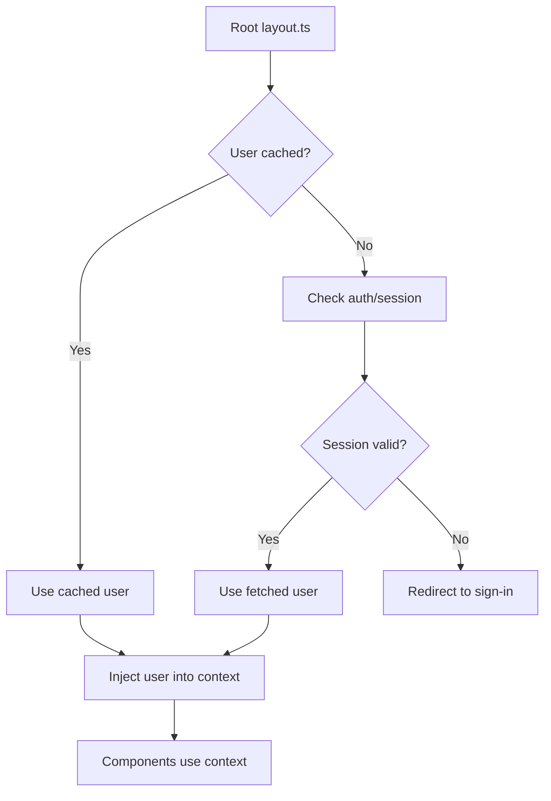

In this section, we explain how to contribute to the Snowballr frontend project. We cover the following topics:

- [Project Layout](#project-layout)
- [User Context](#user-context)
  - [How the User is Fetched and Made Available](#how-the-user-is-fetched-and-made-available)
  - [How to Use the User Context in Components](#how-to-use-the-user-context-in-components)
  - [Refreshing User Data](#refreshing-user-data)
- [Testing](#testing)
- [Lighthouse](#lighthouse)

To set up the development environment, follow the steps in
[Getting Started](https://github.com/SE-UUlm/snowballr-frontend/wiki/Getting-Started).

## Project Layout

```plaintext
.
├── api/ (snowballr-api submodule)
├── src/
│   ├── lib/
│   │   ├── components/
│   │   │   ├── composites/ (our components)
│   │   │   └── primitives/ (shadcn/ui components)
│   │   └── model/
│   │       └── api/ (auto-generated API code)
│   └── routes/ (website layout)
└── tests/
    ├── e2e/
    ├── integration/
    └── unit/
```

## User Context

The application provides a global user context that makes the currently authenticated user's data available throughout
the component tree.

### How the User is Fetched and Made Available



The initial user loading logic lives in the root layout.ts file. It checks whether a user is already cached using the
userCache. If no cached user is found, it attempts to determine the current authentication status and fetch the user
accordingly. If the user is unauthenticated or the session is invalid, it tries to renew the session or redirects to
the sign-in page if necessary.

The resulting user object—whether fetched, cached, or an explicit "empty" user—is returned from layout.ts and injected
into the user context by the root layout.svelte file. This ensures the user state is consistent and accessible
throughout the app.

Components can safely assume that the user object is always valid and never `null` or `undefined`. In cases where the
user is not authenticated, the app will redirect to the sign-in page before components are rendered. This eliminates
the need for `null` checks in downstream components that rely on user data.

### How to Use the User Context in Components

To access the current user's data within any Svelte component that is a child of the main layout:

1. Import necessary utilities:
   You'll need `getContext` from Svelte, the `UserContextKey`, and potentially the `User` type.
2. Retrieve and use the user data:
   Use `getContext` with `UserContextKey` to get the getter function, and then call it. Wrap this in `$derived` to
   create a reactive variable that automatically updates when the user context changes.

   ```svelte
   <script lang="ts">
     import { getContext } from "svelte";
     import { UserContextKey, type UserContext } from "$lib/current-user/userContext";

     const user = $derived(getContext<UserContext>(UserContextKey)());

     function greet() {
       console.log(`Hello, ${user.firstName}!`);
     }
   </script>

   <p>Welcome, {user.firstName} {user.lastName}!</p>
   ```

### Refreshing User Data

If an action within a component modifies user data on the backend (e.g. updating profile information), you'll need to
trigger a refresh of the user context to ensure all parts of the application have the latest data.

1. Import the refresh function:

   ```svelte
   import {triggerCurrentUserRefresh} from "$lib/current-user/userCache";
   ```

2. Call the function after an update:

   ```svelte
   <script lang="ts">
     import { backendService } from "$lib/grpc-api";
     import { triggerCurrentUserRefresh } from "$lib/current-user/userCache";
     import { toast } from "svelte-sonner";
     import { StatusCodes } from "$lib/model/error-codes";
     import { getContext } from "svelte";
     import { UserContextKey, type UserContext } from "$lib/current-user/userContext";

     const user = $derived(getContext<UserContext>(UserContextKey)());

     async function handleNameUpdate(newName: string) {
       try {
         const response = await backendService.updateUser({
           user: { id: user.id, firstName: newName /* other fields */ },
           mask: { paths: ["first_name"] }, // Example field mask
         }).response;

         // Assuming your backendService call doesn't throw on non-OK gRPC status
         // and returns a structure with a status code. Adjust as per your actual API.
         // Or, if it throws, catch the error.

         triggerCurrentUserRefresh();
         toast.success("User details updated successfully!");
       } catch (error) {
         console.error("Failed to update user:", error);
         toast.error("Failed to update user details.");
       }
     }
   </script>
   ```

## Testing

For information about our testing setup, see [Testing](https://github.com/SE-UUlm/snowballr-frontend/wiki/Testing).

## Lighthouse

We use Lighthouse to audit the performance, accessibility and best practices of our app.
To run a Lighthouse audit on the app, you can use the following command:

```bash
npm run lighthouse
```

To run all available routes, use:

```bash
npm run lighthouse:all
```

The report will be saved in the `./lighthouse-reports` directory. To automatically open the report in your browser,
you can use the `--view` flag:

```bash
npm run lighthouse -- --view
# or
npm run lighthouse:all -- --view
```

To only run a sub-route, you can use the `--dir` flag:

```bash
npm run lighthouse -- --dir=/settings
# or
npm run lighthouse:all -- --dir=/settings
```
